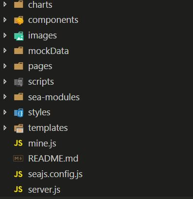

## 软件开发部-前端技术方案一

### 目录

\* [1. 项目简介](#1、项目简介)

\* [2. 项目特色](#2、项目特色)

\* [3. 技术选型](#3、技术选型)

\* [4. 目录结构](#4、目录结构)

\* [5. 目录说明](#5、目录说明)

\* [6.启动项目 ](#6、启动项目)

### 1、技术方案简介

每次接手到一个项目或产品都从零开始创建一个新的目录结构及环境搭建是非常耗时的。作为开发人员，我们应该花费更多的时间来进行业务逻辑的开发，而不是配置项目结构及环境，generator-seajs可以帮助开发人员快速搭建项目目录结构及环境，将开发人员从繁琐的项目配置和构建中解放出来，使其有更多的时间专注于业务的开发。

### 2、技术方案特色

- 结合seajs进行模化编程；
- 对浏览器兼容性高，主流浏览器全部支持，IE浏览器可兼容到IE8；
- 统一的目录结构；
- 支持Mock数据；

### 3、技术选型

- sea.js/sea-text.js：实现模块化编程；


- es3/es5：JavaScript 不需要使用babel编译；
- html、handlebars：构建用户界面；
- css：样式美化；
- ajax：发送网络请求；
- mockjs：模拟数据；
- d3.js：绘制个性化图表.

### 4、目录结构

	

### 5、目录说明

- template：handlebars模板文件；
- mockData：使用mockjs生成的测试数据；
- charts：使用D3开发的图表组件；
- images：图片，包括jpg、png、gif和svg图标等；
- pages：HTML页面；
- scripts：JavaScript代码:
  - common：工具类文件，如通用方法、常量等；
  - 各个模块对应的文件夹。
- sea-modules：引用的第三方库文件，如seajs、jQuery等；
- styles：CSS样式文件；
- seajs.cofig.js：seajs配置文件，可以配置一些别名，方面引用；
- mine.js：类型文件，供server.js文件使用；
- server.js：简单的Nodejs服务器，用于启动服务

### 6、启动项目

```
$ cd generator-es6
$ npm start
```

然后在浏览器中访问`localhost:3000/pages/index.html`，就可以看到页面效果。

#### 


#### 


